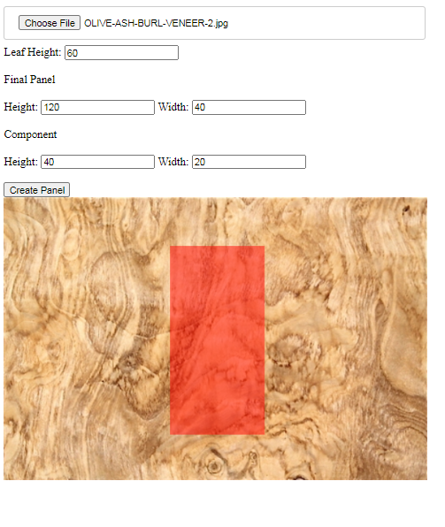
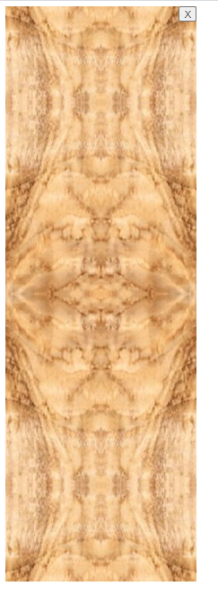

# woodveneer

Design veneers and play with the possibilities. Start with an image of a veneer leaf, select a component part and the panel will be created with a book/butt match of the component.

This is a Node/Express project and uses the Sharp Imaging library.

 
The generated panel with the book and butt match:

